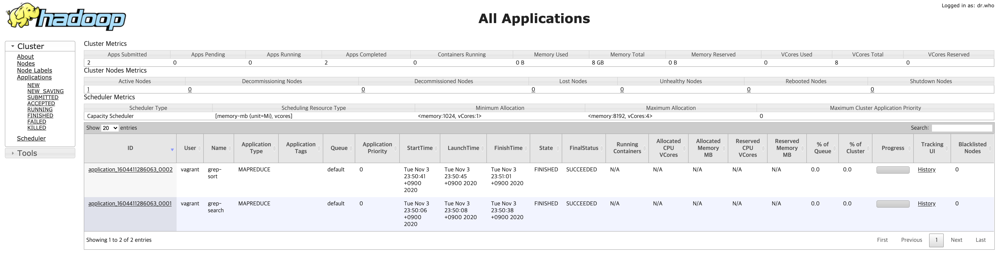
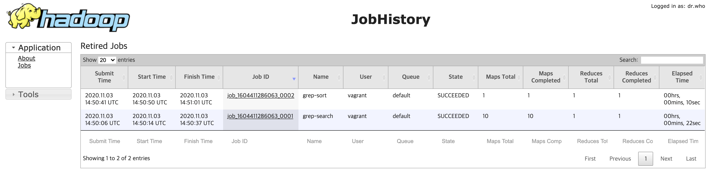

# Hadoop in Secure Mode

Apache Hadoop 3.3.0: [Hadoop in Secure Mode](https://hadoop.apache.org/docs/r3.3.0/hadoop-project-dist/hadoop-common/SecureMode.html)

When running Hadoop in secure mode, all Hadoop services and users must authenticate using Kerberos. 

---

## Download

`ansible/files/dist` Create a directory. 

### Hadoop 3.3.0

Download the `hadoop-3.3.0.tar.gz` file to the `ansible/files/dist` path.

- [Hadoop Mirrors](http://www.apache.org/dyn/closer.cgi/hadoop/common/)
- Index of [/hadoop/common/hadoop-3.3.0](https://downloads.apache.org/hadoop/common/hadoop-3.3.0/)

```
wget https://downloads.apache.org/hadoop/common/hadoop-3.3.0/hadoop-3.3.0.tar.gz
```
### Apache Commons Daemon 1.2.3

Download the `commons-daemon-1.2.3-src.tar.gz` file to the `ansible/files/dist` path. 

- Index of [/dist/commons/daemon/source](https://downloads.apache.org/commons/daemon/source/)

```
wget https://archive.apache.org/dist/commons/daemon/source/commons-daemon-1.2.3-src.tar.gz
```
---

## Software

Build a virtual machine cluster in a local environment using Vagrant, VirtualBox, and Ansible.

- [Vagrant](https://www.vagrantup.com/downloads)
- [VirtualBox](https://www.virtualbox.org/wiki/Downloads)
- [Ansible](https://docs.ansible.com/ansible/latest/installation_guide/intro_installation.html)

```
curl -fsSL https://apt.releases.hashicorp.com/gpg | sudo apt-key add -
sudo apt-add-repository "deb [arch=amd64] https://apt.releases.hashicorp.com $(lsb_release -cs) main"
sudo apt-get update && sudo apt-get install vagrant
```

### vagrant commands

```bash
vagrant up # provision VM
vagrant status # VM status
vagrant ssh my # connect to the VM
vagrant destroy -f # Initialize the VM
```

---

## Run the server

### Initialize HDFS Namenode

If the `/tmp/hadoop-hdfs` directory does not exist, run the following command:

```bash
sudo su - hdfs -c '/etc/hadoop/bin/hdfs namenode -format -force'
```

### Running HDFS Namenode 

```bash
sudo su - hdfs -c '/etc/hadoop/bin/hdfs --daemon start namenode'
```

### Running HDFS Datanode 

```bash
sudo /etc/hadoop/bin/hdfs --daemon start datanode
```

### Setting up the HDFS file system 

Initialize HDFS with the following structure: 

```bash
sudo su - hdfs -c '/vagrant/ansible/files/script/setup.hdfs.sh'
```

#### HDFS filesystem 

```bash
sudo su - hdfs -c '/etc/hadoop/bin/hdfs dfs -ls -R /'
```

```bash
drwxrwxrwt   - mapred hadoop          0 2020-11-04 00:29 /mr-history
drwxr-x---   - mapred hadoop          0 2020-11-04 00:29 /mr-history/done
drwxrwxrwt   - mapred hadoop          0 2020-11-04 00:29 /mr-history/tmp
drwxrwxrwt   - hdfs   hadoop          0 2020-11-04 00:28 /tmp
drwxrwxrwt   - yarn   hadoop          0 2020-11-04 00:28 /tmp/logs
drwxr-xr-x   - hdfs   hadoop          0 2020-11-04 00:28 /user
drwx------   - hdfs   hadoop          0 2020-11-04 00:28 /user/hdfs
drwx------   - mapred hadoop          0 2020-11-04 00:28 /user/mapred
drwx------   - yarn   hadoop          0 2020-11-04 00:28 /user/yarn
```

### Run YARN resource manager 

```bash
sudo su - yarn -c '/etc/hadoop/bin/yarn --daemon start resourcemanager'
```
### Run YARN node manager 

```bash
sudo /etc/hadoop/bin/yarn --daemon start nodemanager
```

### Running MAPRED MapReduce Job History Server 

```bash
sudo su - mapred -c '/etc/hadoop/bin/mapred --daemon start historyserver'
```

---

## List of running servers 

```bash
sudo jps # Java Virtual Machine Process Status Tool
```

```bash
4706 Jps
4436 NodeManager
3784 NameNode
4616 JobHistoryServer
4121 ResourceManager
3981 Secur
```

---

## Web Interfaces

| Daemon | Web Interface | Default HTTP port | Localhost Link |
|---|---|---|---|
| NameNode | `http://nn_host:port/` | 9870 | [http://localhost:9870](http://localhost:9870) |
| ResourceManager | `http://rm_host:port/` | 8088 | [http://localhost:8088](http://localhost:8088) |
| MapReduce JobHistory Server | `http://jhs_host:port/` | 19888 | [http://localhost:19888](http://localhost:19888) |

---

## Test

1. Access HDFS without permission
1. User authentication
1. HDFS access
1. Running a MapReduce job
1. Check the result

### Set environment variables 

```bash
export HADOOP_HOME=/etc/hadoop
export PATH=$PATH:$HADOOP_HOME/bin
```

### Check HDFS access error

The `vagrant` user cannot access HDFS.

```bash
hdfs dfs -ls -R /
```

```bash
2020-11-03 14:17:18,317 WARN ipc.Client: Exception encountered while connecting to the server 
org.apache.hadoop.security.AccessControlException: Client cannot authenticate via:[TOKEN, KERBEROS]
```

### Create HDFS user directory 

```bash
sudo su - hdfs -c '/etc/hadoop/bin/hdfs dfs -mkdir /user/vagrant'
sudo su - hdfs -c '/etc/hadoop/bin/hdfs dfs -chown vagrant:hadoop /user/vagrant'
sudo su - hdfs -c '/etc/hadoop/bin/hdfs dfs -chmod 700 /user/vagrant'
```

### Create vagrant keytab 

```bash
sudo kadmin -p admin/admin -w password -q 'addprinc -pw password vagrant/my.example.com@EXAMPLE.COM'
```

### Create Kerberos ticket 

```bash
kinit vagrant/my.example.com@EXAMPLE.COM

Password for vagrant/my.example.com@EXAMPLE.COM: password
```

### Check Kerberos ticket 

```bash
klist
```

```bash
Ticket cache: FILE:/tmp/krb5cc_1000
Default principal: vagrant/my.example.com@EXAMPLE.COM

Valid starting       Expires              Service principal
11/04/2020 00:32:15  11/04/2020 12:32:15  krbtgt/EXAMPLE.COM@EXAMPLE.COM
        renew until 11/05/2020 00:32:15
```

### Check HDFS access 

```bash
hdfs dfs -ls -R /
```

```bash
drwxrwxrwt   - mapred hadoop          0 2020-11-04 00:29 /mr-history
drwxr-x---   - mapred hadoop          0 2020-11-04 00:29 /mr-history/done
ls: Permission denied: user=vagrant, access=READ_EXECUTE, inode="/mr-history/done":mapred:hadoop:drwxr-x---
drwxrwxrwt   - mapred hadoop          0 2020-11-04 00:29 /mr-history/tmp
drwxrwxrwt   - hdfs   hadoop          0 2020-11-04 00:31 /tmp
drwxrwx---   - mapred hadoop          0 2020-11-04 00:31 /tmp/hadoop-yarn
ls: Permission denied: user=vagrant, access=READ_EXECUTE, inode="/tmp/hadoop-yarn":mapred:hadoop:drwxrwx---
drwxrwxrwt   - yarn   hadoop          0 2020-11-04 00:28 /tmp/logs
drwxr-xr-x   - hdfs   hadoop          0 2020-11-04 00:31 /user
drwx------   - hdfs    hadoop          0 2020-11-04 00:28 /user/hdfs
ls: Permission denied: user=vagrant, access=READ_EXECUTE, inode="/user/hdfs":hdfs:hadoop:drwx------
drwx------   - mapred  hadoop          0 2020-11-04 00:28 /user/mapred
ls: Permission denied: user=vagrant, access=READ_EXECUTE, inode="/user/mapred":mapred:hadoop:drwx------
drwx------   - vagrant hadoop          0 2020-11-04 00:31 /user/vagrant
drwx------   - yarn    hadoop          0 2020-11-04 00:28 /user/yarn
ls: Permission denied: user=vagrant, access=READ_EXECUTE, inode="/user/yarn":yarn:hadoop:drwx------
```

### Upload file

```bash
hdfs dfs -mkdir -p /user/vagrant/input
hdfs dfs -copyFromLocal $HADOOP_HOME/etc/hadoop/*.xml input
```

Confirm:

```bash
hdfs dfs -ls /user/vagrant/input
```

### Add working directory permissions

```bash
sudo su - hdfs -c '/etc/hadoop/bin/hdfs dfs -chmod -R 777 /tmp/hadoop-yarn'
```

---

## MapReduce example

### list of tests 

```bash
hadoop jar $HADOOP_HOME/share/hadoop/mapreduce/hadoop-mapreduce-examples-3.3.0.jar
```

### Run the example

Running the MapReduce example

```bash
hadoop jar \
$HADOOP_HOME/share/hadoop/mapreduce/hadoop-mapreduce-examples-3.3.0.jar \
grep input output 'dfs[a-z.]+'
```

#### Execution log 

```log
2020-11-04 00:34:16,786 INFO client.DefaultNoHARMFailoverProxyProvider: Connecting to ResourceManager at /0.0.0.0:8032
2020-11-04 00:34:17,113 INFO hdfs.DFSClient: Created token for vagrant: HDFS_DELEGATION_TOKEN owner=vagrant/my.example.com@EXAMPLE.COM, renewer=yarn, realUser=, issueDate=1604450057092, maxDate=1605054857092, sequenceNumber=1, masterKeyId=2 on 192.168.9.100:9000
```

```log
2020-11-04 00:35:01,108 INFO mapreduce.Job: Running job: job_1604449775800_0002
2020-11-04 00:35:11,295 INFO mapreduce.Job: Job job_1604449775800_0002 running in uber mode : false
2020-11-04 00:35:11,296 INFO mapreduce.Job:  map 0% reduce 0%
2020-11-04 00:35:16,356 INFO mapreduce.Job:  map 100% reduce 0%
2020-11-04 00:35:20,395 INFO mapreduce.Job:  map 100% reduce 100%
2020-11-04 00:35:21,411 INFO mapreduce.Job: Job job_1604449775800_0002 completed successfully
```

```log
Map-Reduce Framework
    Map input records=19
    Map output records=19
    Map output bytes=701
    Map output materialized bytes=745
    Input split bytes=138
    Combine input records=0
    Combine output records=0
    Reduce input groups=2
    Reduce shuffle bytes=745
    Reduce input records=19
    Reduce output records=19
    Spilled Records=38
    Shuffled Maps =1
    Failed Shuffles=0
    Merged Map outputs=1
File Input Format Counters 
    Bytes Read=939
File Output Format Counters 
    Bytes Written=587
```

### Check the result

#### output directory

```bash
hdfs dfs -ls output
```

```bash
Found 2 items
-rw-r--r--   1 vagrant hadoop          0 2020-11-04 00:35 output/_SUCCESS
-rw-r--r--   1 vagrant hadoop        587 2020-11-04 00:35 output/part-r-00000
```

#### MapReduce result file 

```bash
hdfs dfs -cat output/*
```

```txt
2	dfs.web.authentication.kerberos.principal
1	dfsadmin
1	dfs.secondary.namenode.keytab.file
1	dfs.secondary.namenode.kerberos.principal
1	dfs.replication
1	dfs.namenode.secondary.https
1	dfs.namenode.secondary.http
1	dfs.namenode.keytab.file
1	dfs.namenode.kerberos.principal
1	dfs.namenode.kerberos.internal.spnego.principal
1	dfs.encrypt.data.transfer
1	dfs.datanode.keytab.file
1	dfs.datanode.kerberos.principal
1	dfs.datanode.https.address
1	dfs.datanode.http.address
1	dfs.datanode.data.dir.perm
1	dfs.datanode.address
1	dfs.data.transfer.protection
1	dfs.block.access.token.enable
```

---

## Yarn example

### Set environment variables

```bash
export YARN_EXAMPLES=/etc/hadoop/share/hadoop/mapreduce
```

### Pi Calculation Example

```bash
yarn jar $HADOOP_HOME/share/hadoop/mapreduce/hadoop-mapreduce-examples-3.3.0.jar pi 16 100000
```

### result

```bash
Job Finished in 39.101 seconds
Estimated value of Pi is 3.14157500000000000000
```

---

## Check Web Interface 

### ResourceManager



### JobHistory


